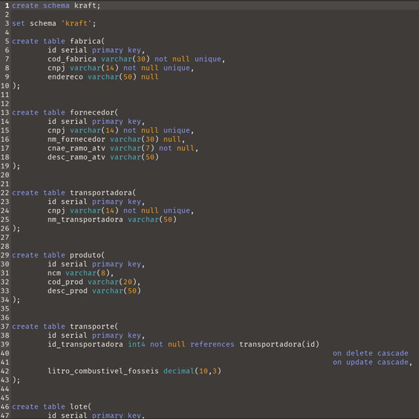
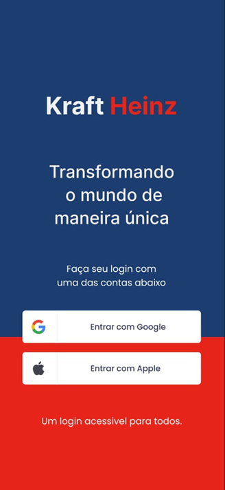
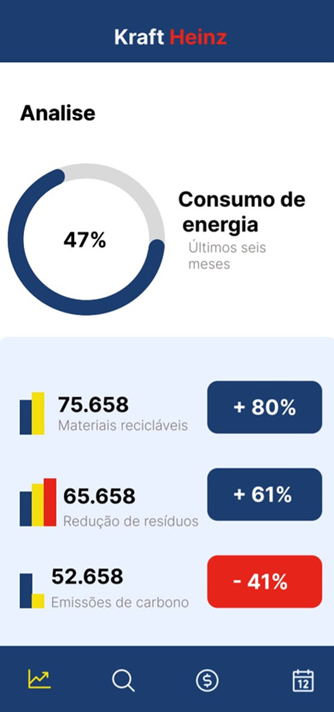
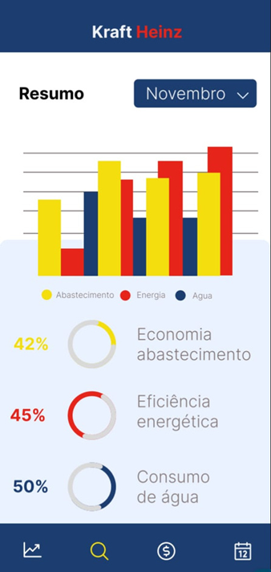
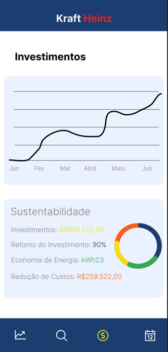
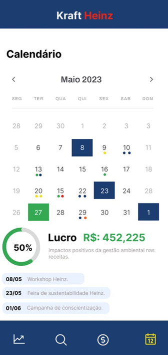
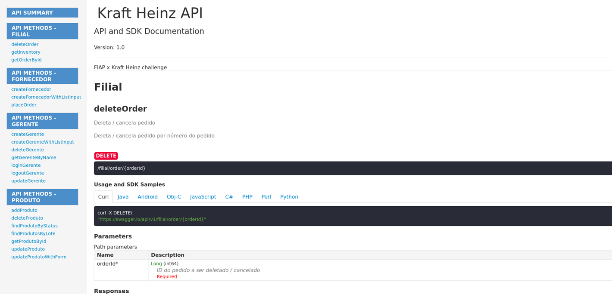

## ENTERPRISE CHALLENGE - MONITORAMENTO E GESTÃO AMBIENTAL
### Projeto Realizado para Conclusão de Curso em parceria com a empresa KraftHeinz

> Este README serve como uma pequena apresentação e explicação da ideia do projeto!

#### O Desafio
* Criar uma solução para gerir e acompanhar metas através do gerenciamento inteligente de recursos de produção e conscientização social, para que assim tais metas possam ser cumpridas.

#### A Solução
* A ideia central do projeto é baseada em sustentabilidade, as formas de promover tal sustentabilidade e acompanhar o desenvolvimento das vias de gestão ambiental dentro e fora da empresa, de forma que possa ser visível a mudança sustentável e que se torne clara a via dos meios de produção.

#### Conteudo
* A modelagem abaixo demonstra como ocorre o armazenamento dos dados referentes a todos os processos principais de gestão produto e produção sustentável, fazendo com que fique mais claro os caminhos que o produto faz desde o fornecedor até as filiais e mais fácil de localizá-los e identificá-los 

> ##### Diagrama

> ##### Modelo Fisico

##### Telas para App Mobile
* Tendo em mente a facilidade de acesso a recursos para administrar estes dados e uma maior facilidade de visualização, temos aqui o aplicativo de gerenciamento de produtos e finanças KraftHeinz.

* O aplicativo em questão disponibiliza o gerenciamento e a visão geral de lucros, economia por valor e porcentagem (separados por setor), análise de crescimento de produção sustentável, área de gerenciamento de investimentos e muito mais!

##### API

* Para concluir, temos a API que nos fornece rotas definidas, criadas pelo swagger, modelando uma API que server como um intermédio entre o banco de dados e o app mobile.

### Agradeço por sua atenção!

