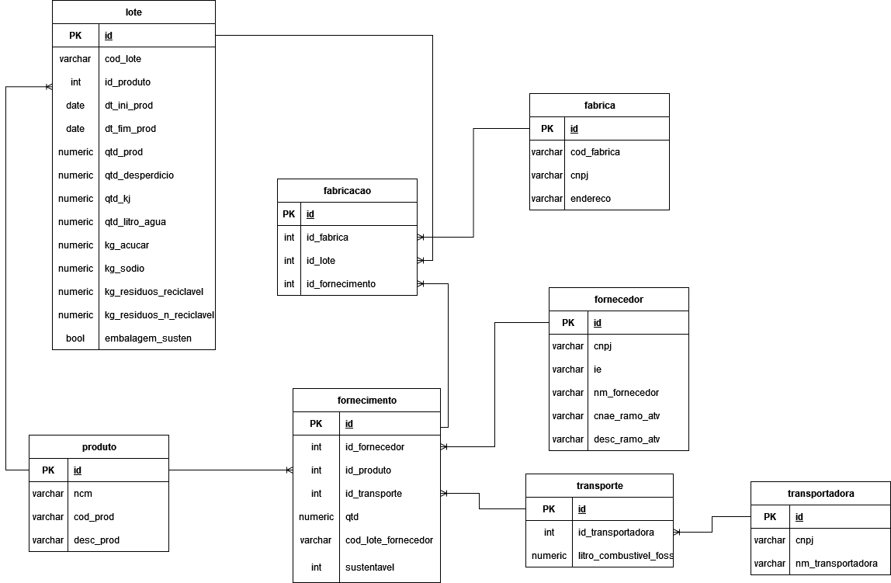

## ENTERPRISE CHALLENGE - MONITORAMENTO E GESTÃO AMBIENTAL
### Projeto Realizado para Conclusão de Curso em parceria com a empresa KraftHeinz

#### Introdução
> Este README serve como uma pequena apresentação e explicação da ideia do projeto!

#### O Desafio
> * Criar uma solução para gerir e acompanhar tais metas através do gerenciamento inteligente de recursos de produção e conscientização social, para que assim tais metas possam ser cumpridas.

#### A Solução
> * A ideia central do projeto é baseada em sustentabilidade, as formas de promover tal sustentabilidade e acompanhar o desenvolvimento das vias de gestão ambiental dentro e fora da empresa, de forma que possa ser visível a mudança sustentável e que se torne clara a via dos meios de produção.

#### Conteudo
> * A modelagem abaixo demonstra como ocorre o armazenamento dos dados referentes a todos os processos principais de gestão produto e produção sustentável, fazendo com que fique mais claro os caminhos que o produto faz desde o fornecedor até as filiais e mais fácil de localizá-los e identificá-los 

> Ainda no conteudo deste projeto inclui a criação do Modelo Fisico, Criação das Telas e a API

